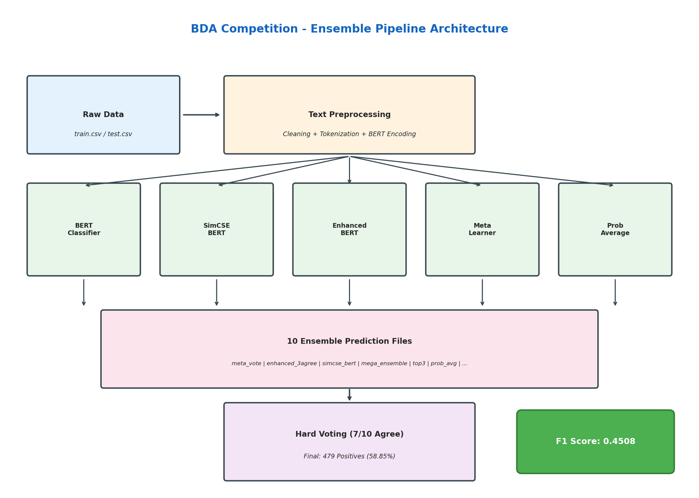
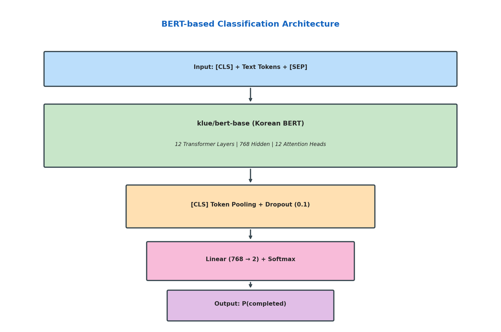
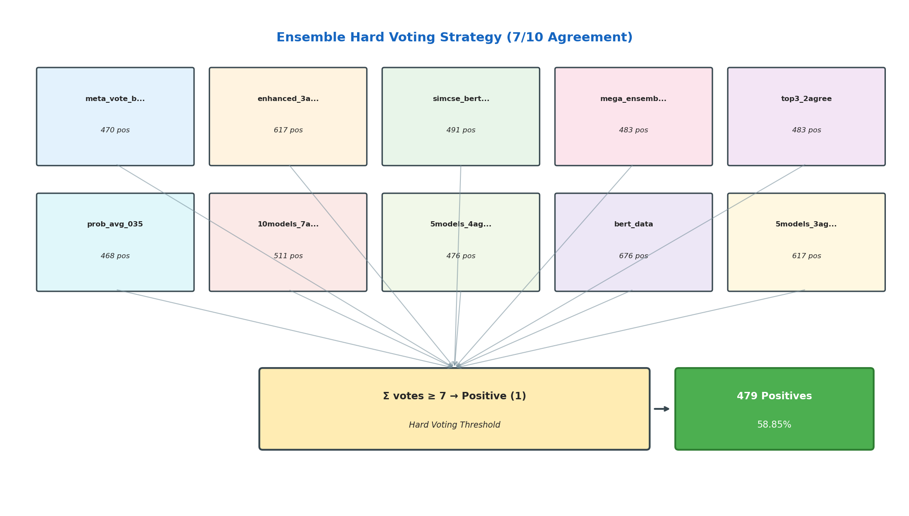

# DACON x BDA 2차 AI 경진대회
## 학습자 과정 이수율 예측

<div align="center">


**Public F1 Score: 0.4508 | Private F1 Score: 0.42168**

</div>

---

## 프로젝트 개요

DACON x BDA 2차 AI 경진대회 최종 제출 코드입니다. 학습자의 학습 행동 데이터와 메타데이터를 기반으로 온라인 과정 이수 여부를 예측합니다.

**BERT 기반 텍스트 분류**와 **앙상블 학습**을 결합하여 다중 모델 합의 투표 방식으로 강건한 예측을 수행합니다.

---

## 파이프라인 아키텍처

<div align="center">

</div>

---

## 데이터 분석 및 전처리

### 데이터셋 개요

| 데이터셋 | 샘플 수 | 특성 | 타겟 변수 |
|---------|--------|------|----------|
| Train | 748 | 텍스트 + 메타데이터 | `completed` (0/1) |
| Test | 814 | 텍스트 + 메타데이터 | - |

### 주요 데이터 특성

1. **텍스트 특성**
   - 한국어로 작성된 지원 동기, 목표, 강의 규모 선택 이유
   - 관심 기업, 희망 직무 등 주관식 응답
   - 가변 길이 텍스트로 동적 토큰화 필요

2. **클래스 분포**
   - 이진 분류 (이수 완료 여부)
   - 양성 클래스 (이수 완료): ~55-60%
   - 음성 클래스 (미이수): ~40-45%

3. **전처리 파이프라인**
   ```
   정형 데이터 (train.csv) → 텍스트 변환 → BERT 토큰화 → 모델 입력
   ```
   - **텍스트 변환**: 정형 컬럼을 자연어 문장으로 변환
   - **토큰화**: BERT WordPiece 토큰화 (최대 512 토큰)
   - **인코딩**: [CLS] + 토큰 + [SEP] 형식

### 텍스트 변환 예시

```
입력 (train.csv):
  - whyBDA: "혼자 공부하기 어려워서"
  - what_to_gain: "프로젝트 경험"
  - job: "대학생"
  - ...

출력 (bert_train_data.csv):
  "지원 동기: 혼자 공부하기 어려워서. 얻고자 하는 점: 프로젝트 경험.
   직업은 대학생입니다. 전공 유형은 복수 전공이며, 전공 분야는 IT입니다..."
```

---

## BERT 모델 선택 이유

<div align="center">

</div>

### BERT 기반 접근법의 장점

| 측면 | 전통적 ML | BERT 기반 |
|-----|----------|----------|
| **텍스트 이해** | Bag-of-words, TF-IDF | 문맥 임베딩 |
| **한국어 처리** | 형태소 분석 한계 | 한국어 코퍼스 사전학습 |
| **의미 파악** | 표면적 패턴 | 심층 의미 관계 |
| **전이 학습** | 적용 불가 | 사전학습 지식 활용 |

### `klue/bert-base` 선택 이유

1. **한국어 최적화**
   - 62GB 한국어 텍스트 코퍼스로 사전학습
   - 한국어 문법과 의미 네이티브 이해
   - 한국어 특화 토큰화 (서브워드 단위)

2. **아키텍처 사양**
   - **레이어**: 12개 Transformer 인코더 블록
   - **히든 크기**: 768 차원
   - **어텐션 헤드**: 12개 멀티헤드 어텐션
   - **파라미터**: 약 1.1억개

3. **성능 이점**
   - 지원 동기, 목표 등 긴 문맥의 의존성 파악
   - 학습자 행동 설명의 맥락 이해
   - 어휘 변형 및 오타에 강건

---

## 피처 엔지니어링

### 정형 데이터 피처 (25개 이상)

| 카테고리 | 피처명 | 설명 |
|---------|-------|------|
| **기본 정보** | is_re_registration | 재등록 여부 |
| | is_student, is_worker | 직업 (대학생/직장인) |
| | is_multiple_major | 복수전공 여부 |
| **수강 정보** | num_classes | 수강 클래스 수 |
| | num_prev_classes | 이전 기수 참여 수 |
| **역량** | has_certificate | 자격증 보유 여부 |
| | is_it_major, is_data_major | IT/데이터 전공 여부 |
| **동기 분석** | why_curriculum | 커리큘럼 언급 |
| | why_alone | 혼자 공부 어려움 |
| | why_satisfied | 이전 만족 언급 |
| **목표 분석** | gain_project | 프로젝트 경험 희망 |
| | gain_analysis | 분석 역량 희망 |
| | gain_contest | 공모전 경험 희망 |
| **시간/학기** | high_time_commitment | 높은 시간 투자 (3시간+) |
| | is_senior, is_junior | 고학년/저학년 여부 |
| **희망 직무** | want_data_analyst | 데이터 분석가 희망 |
| | want_data_scientist | 데이터 사이언티스트 희망 |
| **복합 피처** | commitment_score | 의지 점수 (재등록+기존회원+만족) |
| | experience_score | 경험 점수 (이전참여+고학년+자격증) |
| | it_relevance | IT 관련도 |

---

## 앙상블 전략

<div align="center">

</div>

### 10개 모델 하드 보팅 앙상블

**7/10 동의 임계값**을 적용한 하드 보팅 전략을 사용합니다.

| # | 모델 파일 | 설명 | Positives |
|---|----------|------|-----------|
| 1 | `meta_vote_both` | 5models AND enhanced 메타 학습 | 470 |
| 2 | `enhanced_3agree` | Enhanced BERT 3개 동의 | 617 |
| 3 | `simcse_bert_4agree` | SimCSE BERT 4개 동의 | 491 |
| 4 | `mega_ensemble_3agree` | 메가 앙상블 3개 동의 | 483 |
| 5 | `top3_2agree` | Top 3 모델 2개 동의 | 483 |
| 6 | `prob_avg_035` | 확률 평균 (임계값 0.35) | 468 |
| 7 | `10models_7agree` | 10개 모델 7개 동의 | 511 |
| 8 | `5models_4agree` | 5개 모델 4개 동의 | 476 |
| 9 | `bert_data` | 단일 BERT 분류기 | 676 |
| 10 | `5models_3agree` | 5개 모델 3개 동의 | 617 |

### 투표 로직

```python
# 7/10 임계값 하드 보팅
vote_sum = sum(model_predictions)  # 10개 이진 예측의 합
final_prediction = 1 if vote_sum >= 7 else 0
```

**최종 결과**: 479개 Positive (58.85%)

---

## 프로젝트 구조

```
final_submit/
├── main.ipynb                      # 최종 앙상블 노트북 (메인 실행 파일)
├── generate_diagrams.py            # 아키텍처 다이어그램 생성
├── README.md
├── requirements.txt
├── assets/                         # 생성된 다이어그램
│   ├── pipeline_architecture.png
│   ├── bert_architecture.png
│   └── ensemble_voting.png
├── src/                            # 소스 코드
│   ├── preprocessing/              # 데이터 전처리
│   │   └── create_bert_data.py     # train.csv → bert_train_data.csv 변환
│   ├── models/                     # 모델 학습 코드
│   │   ├── text/                   # 텍스트 모델
│   │   │   ├── model1_bert_data.py
│   │   │   ├── model2_koelectra_detailed.py
│   │   │   └── model3_klue_sentiment.py
│   │   └── tabular/                # 정형 모델 + 피처 엔지니어링
│   │       ├── model5_xgboost_enhanced.py
│   │       └── model6_catboost_enhanced.py
│   └── ensemble/                   # 앙상블 코드
│       ├── ensemble_5models.py
│       └── ensemble_enhanced.py
├── models/                         # 10개 앙상블 예측 파일
│   └── submission_*.csv
├── outputs/                        # 최종 제출 파일
│   └── submission_10files_7agree.csv
└── data/                           # 데이터셋
    ├── train.csv                   # 원본 정형 데이터 (학습)
    ├── test.csv                    # 원본 정형 데이터 (추론)
    ├── bert_train_data.csv         # BERT용 텍스트 (학습)
    └── bert_test_data.csv          # BERT용 텍스트 (추론)
```

---

## 개발 환경

| 구성 요소 | 버전 |
|----------|------|
| **OS** | Linux (Ubuntu 20.04+) |
| **Python** | 3.8+ (테스트: 3.12.2) |
| **PyTorch** | 2.0+ (테스트: 2.9.1+cu128) |
| **Transformers** | 4.30+ (테스트: 4.57.6) |
| **CUDA** | 12.8 (GPU 사용 시) |
| **NumPy** | 1.21+ (테스트: 1.26.4) |
| **Pandas** | 1.3+ (테스트: 3.0.0) |
| **Scikit-learn** | 1.0+ (테스트: 1.8.0) |
| **XGBoost** | 1.6+ |
| **CatBoost** | 1.0+ |

---

## 실행 방법

### 1. 환경 설정

```bash
pip install -r requirements.txt
```

### 2. 데이터 전처리 (선택사항)

```bash
# train.csv → bert_train_data.csv 변환
python src/preprocessing/create_bert_data.py
```

### 3. 최종 앙상블 실행

```bash
jupyter notebook main.ipynb
```

또는 Python 스크립트로 직접 실행:

```python
import numpy as np
import pandas as pd
from pathlib import Path

MODELS_DIR = Path('models')
file_names = [
    'submission_meta_vote_both.csv',
    'submission_enhanced_3agree.csv',
    'submission_simcse_bert_4agree.csv',
    'submission_mega_ensemble_3agree.csv',
    'submission_top3_2agree.csv',
    'submission_prob_avg_035.csv',
    'submission_10models_7agree.csv',
    'submission_5models_4agree.csv',
    'submission_bert_data.csv',
    'submission_5models_3agree.csv',
]

preds = {}
for f in file_names:
    df = pd.read_csv(MODELS_DIR / f)
    preds[f] = df['completed'].values
    test_ids = df['ID'].values

# 7개 이상 동의 시 1
vote_sum = sum(preds.values())
final_pred = (vote_sum >= 7).astype(int)

submission = pd.DataFrame({'ID': test_ids, 'completed': final_pred})
submission.to_csv('outputs/submission_10files_7agree.csv', index=False)
print(f'Positives: {final_pred.sum()} ({final_pred.mean()*100:.2f}%)')
```

---

## 결과

| 지표 | 값 |
|-----|---|
| **Public F1 Score** | **0.4508** |
| **Private F1 Score** | **0.42168** |
| 총 샘플 수 | 814 |
| 예측 Positive | 479 (58.85%) |
| 앙상블 모델 수 | 10 |
| 투표 임계값 | 7/10 |

---

## 기술 스택

- **딥러닝**: PyTorch 2.0+
- **자연어처리**: Hugging Face Transformers
- **사전학습 모델**: klue/bert-base, monologg/koelectra-base-finetuned-nsmc
- **정형 모델**: XGBoost, CatBoost
- **앙상블**: 하드 보팅 (임계값 방식)
- **데이터 처리**: Pandas, NumPy
- **인코딩**: UTF-8

---

## 라이선스

본 프로젝트는 교육 및 경진대회 목적으로 작성되었습니다.

---

<div align="center">

**DACON x BDA 2차 AI 경진대회**

PyTorch와 Hugging Face Transformers로 제작

</div>
